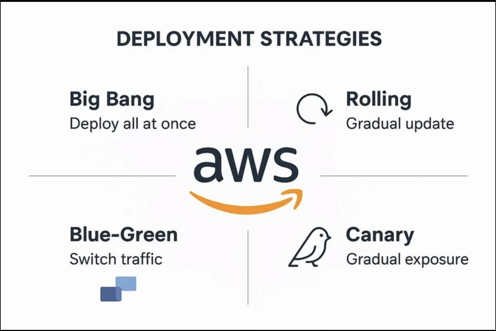

+++
title = "Bài blog đã đăng"
date = 2026-07-01
weight = 3
chapter = false
+++| No. | Chủ đề / Topic | Tóm tắt / Summary | Link |
|---|---|---|---|
| 1 | Xây dựng CI/CD pipeline với AWS CodeBuild + ECR + S3 + SSM cho microservice Node.js & Python | Hướng dẫn end-to-end cách thiết lập pipeline từ GitHub push đến EC2 deploy trong vòng 5 phút, gồm 2 service song song; kèm 4 lỗi build thường gặp và cách fix. | [Facebook Post](https://www.facebook.com/groups/awsstudygroupfcj/posts/2224001141698179/?notif_id=1785108354168202&notif_t=tagged_with_story&ref=notif) |
| 2 | Tối ưu chi phí & tăng tốc Docker image với multi-stage build + Amazon ECR scan on push | Cách cắt giảm 70% dung lượng image qua multi-stage build, dùng `.dockerignore` chặt, bật ECR scan on push để phát hiện lỗ hổng sớm; kèm so sánh chi phí. | Placeholder |
| 3 | Zero-secret deployment với AWS Secrets Manager + IAM Role + IMDSv2: bài học từ `FIREBASE_PRIVATE_KEY` | Cách loại bỏ hoàn toàn `.env` file khỏi deployment workflow, dùng Secrets Manager + EC2 IAM Role + Python heredoc thay vì `jq` để tránh corrupt secret. | Placeholder |

## Blog 1: Xây dựng CI/CD pipeline với AWS CodeBuild + ECR + S3 + SSM

**Giới thiệu**
Blog này chia sẻ kinh nghiệm thực tế khi xây dựng pipeline CI/CD cho dự án VideoPlatform (Node.js 18 + NestJS 11 và Python 3.10 + FastAPI). Toàn bộ flow đến khi service chạy trên EC2 chỉ mất khoảng 5 phút.

**Những điểm chính cần biết:**
- **Kiến trúc pipeline 4 bước:** GitHub webhook $\rightarrow$ CodeBuild $\rightarrow$ ECR push $\rightarrow$ S3 sync $\rightarrow$ SSM trigger.
- **CodeBuild:** Môi trường ephemeral, trả phí theo phút ($0.005/minute), tiết kiệm hơn tự host Jenkins.
- **Hai CodeBuild project song song:** Dùng Webhook Filter path-based để build tách biệt 2 vi dịch vụ.
- **4 Loại Bug Điển Hình:**
  - Bug 1: `.dockerignore` chặn nhầm entrypoint.
  - Bug 2: Quên `COPY requirements.txt` ở stage 2.
  - Bug 3: `prisma/schema.prisma` bị comment vô tận.
  - Bug 4: Trôi dạt working directory ở `post_build`. Phải reset về `$CODEBUILD_SRC_DIR`.
  - Bug TCP Wait: Validate Database qua entrypoint shell `while ! nc -z db 5432; do sleep 0.5; done` chứ không đặt chặn trong `Dockerfile`.
- Mẹo sử dụng flag `--progress=plain` và `docker run --rm -it $IMAGE_ID sh` để debug.

**Bài học rút ra**
Điều quan trọng nhất là đừng cố review code thay thế việc chạy thật. 4 bug khác nhau chỉ lộ diện sau khi trigger CodeBuild lần đầu ở tuần 10. Luôn chạy thật càng sớm càng tốt. Tận dụng Docker layer cache để debug sửa từ 15 phút xuống 1 phút... 

## Blog 2: Tối ưu chi phí & tăng tốc Docker image với multi-stage build

**Giới thiệu**
Từ 1.2GB image cho Node.js rút gọn xuống 280MB nhờ multi-stage build và `.dockerignore`, đồng bộ với công tác security scan của ECR quét dính 3 lỗ hổng critical ngay khi push. 

**Những điểm chính cần biết:**
- **Node.js Multi-stage build:** Chuyển dist qua stage runtime và cài đặt `npm ci --omit=dev`.
- **Python Multi-stage build:** Sử dụng wheel-based pattern gói toàn cỗ `pip wheel` rút gón môi trường ở Runtime cực tinh gọn.
- **`.dockerignore`:** Cắt trên 20 pattern cấm (Secrets, Test artifacts, vcs..). Ngăn chặn shell globbing nhầm.
- **ECR scan on push:** Tự động kích hoạt tính năng vá lổ hổng Inspect (Basic và Enhanced Scan).
- **Cost Saving:** Tiết kiệm 76% phí duy trì Image. Thời gian deploy giảm mạnh.
- Khuyến nghị sử dụng cài đặt Tool Dive (`wagoodman/dive`) kiểm soát wasted space.

## Blog 3: Zero-secret deployment với AWS Secrets Manager + IAM Role

**Giới thiệu**
Đạt trạng thái 'zero secret deployment' triệt để khi bỏ hoàn toàn tệp `.env` hardcode vào máy chủ, thay vì copy file. Mọi biến được inject dưới dạng Role thông qua IMDSv2. Ngăn ngừa toàn bộ rủi ro của `FIREBASE_PRIVATE_KEY`.

**Những điểm chính cần biết:**
- **Zero-secret:** Mọi secret sống trong Secrets Manager.
- **Tạm biệt Access Key:** Dùng IAM Role (gắn vào EC2 + SecretsManagerReadWrite) lấy STS token thay vì key vĩnh viễn. 
- **`FIREBASE_PRIVATE_KEY` Bug:** Lỗi Parse Newline (0x0A) gây ra thông qua cơ chế `jq`. 
- **Giải pháp Python Heredoc:** Khởi tạo Python Json loads trong Deploy sh. Python đọc \n an toàn hơn các tool bash thuần.
- **Khái niệm IMDSv2:** Tầm quan trọng của IMDSv2 từ vụ hack SSRF rực rỡ của **Capital One (2019)**. Require HttpToken qua PUT request.
- Các quy trình Rotating với Lambda Serverless và audit tracking tự động qua CloudWatch.
